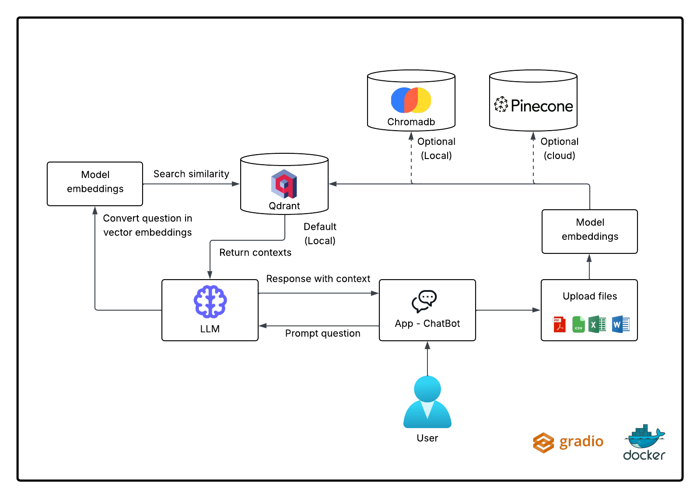
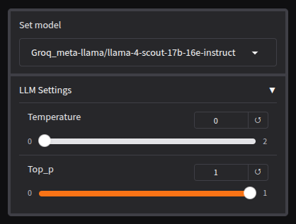
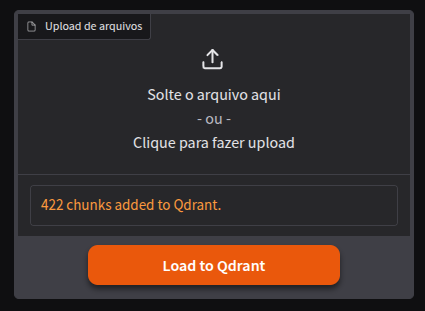
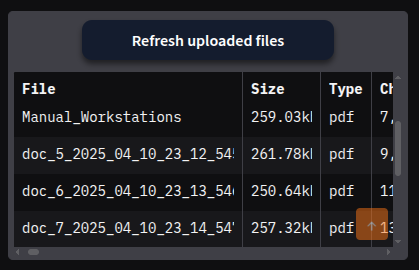
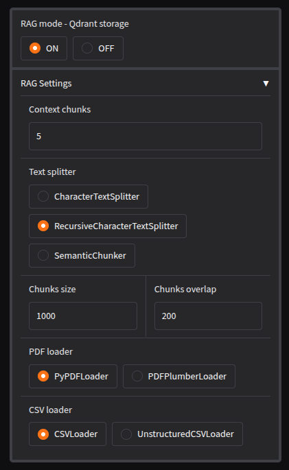
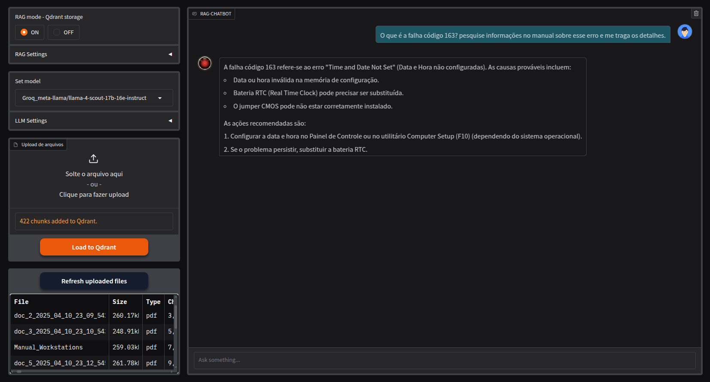

<br/>

# RAG-ChatBot-app

<br/>

**RAG-ChatBot-app** is a chatbot web application to extract and analyze information from documents through Retrieval-Augmented Generation (RAG), built on the powerful Gradio web interface.

This project aims to create an intelligent chatbot that supports a variety of documents, allowing users to ask questions based on their own files such as PDFs, spreadsheets or texts. Using language models (LLMs), vector embeddings and a vector database, the system is able to provide contextualized and accurate answers. The application is built with a focus on local usability via Gradio and Docker, being flexible for use with different storage vectors, such as Qdrant, ChromaDB and Pinecone. The user-friendly interface developed with Gradio facilitates interaction with the chatbot in a simple way and accessible directly through the browser. The diagram below shows the communication flow between the parties involved in the RAG process performed by the application.

<h3 align="center">
  
</h3>

<br/>

## Features

- Support for proprietary LLM models
- Support for local LLM models (Ollama)
- Pre-configured vector storages: Chromadb | Qdrant | Pinecone
- User authentication control
- User-friendly visual for documents analysis powered by awesome Gradio web interface
- Supports .pdf, .csv, .xls, .xlsx, txt and .docx document types
- Ready to deploy wtith Docker

<br/>

## Prerequisites

- [Docker](https://www.docker.com/)
- [Docker-compose](https://docs.docker.com/compose/)
- [Git](https://git-scm.com/)

<br/>

## Get Started

#### Local Instalation via Docker (Recommended):

- Download the repository

```
git clone https://github.com/fab2112/RAG-ChatBot-app.git
cd RAG-ChatBot-app
```

- Set the **.env** file with keys necessary based in custom settings
- Build docker services

```
docker-compose up --build -d
```

<br/>

## Usage

- After docker-compose building access the application in the browser at [http://0.0.0.0:7860](http://0.0.0.0:7860)
- Choose your model and start a chat

<h3 align="center">
  
</h3>

<br/>

#### Load Documents

- Load docs to vector database defined in settings
- The docs are split in chunks of texts + correspondent vector, and loaded to database

<h3 align="center">
  
</h3>

<br/>

#### Control of Uploaded Documents

- This table displays all documents that have been loaded into the database.
- Table attributes: Time, File, Size, Type and Chunk-IDs

<h3 align="center">
  
</h3>

<br/>

#### RAG Definitions

- Custom definitions for processing docs in RAG mode
- For normal chat, select RAG-mode OFF

<h3 align="center">
  
</h3>

<br/>

## Custom Settings

- Access custom settings via the settings.py file for change defaut before building

| Variable             | Details                                      |
| :------------------- | :------------------------------------------- |
| USERS                | Set users authentication login               |
| LANGUAGE             | LLM response language                        |
| OLLAMA_URL           | Ollama internal Docker url                   |
| QDRANT_URL           | Qdrant internal Docker url                   |
| CHROMADB_URL         | Chroma internal Docker url                   |
| RETRIEVER            | Database retriever                           |
| VECSTORAGE           | Vector database                              |
| DATABASE_NAME        | Name of space in vector database             |
| PINECONE_REGION      | Pinecone database on-premises infrastructure |
| PINECONE_CLOUD       | Pinecone database cloud                      |
| EMBEDDINGS_RATELIMIT | Ratelimit of embeddings chunks per seconds   |
| MODELS               | LLM models                                   |
| EMBEDDINGS_MODEL     | Model embeddings and dense vector dim        |

<br/>

## Local Ollama Settings

- Making the service accessible through Docker
- Add the following line under the [Service] section in "/etc/systemd/system/ollama.service"

```
Environment="OLLAMA_HOST=0.0.0.0"
```

- Save, exit, reload the systemd configuration and restart Ollama

```
systemctl daemon-reload
systemctl restart ollama
```

- Load the desired models in local host
- Search for the best model that suits you [https://ollama.com/](https://ollama.com/)

```
ollama run gemma3:1b                     # model for chat
ollama run nomic-embed-text:latest       # model for embeddings
```

<br/>

## Ecosystem

- Infrastructure

| Component      | Version  |
| -------------- | -------- |
| Docker Engine  | 28.0.4   |
| Docker Compose | 2.34.0   |
| Ollama         | 0.6.3    |

<br/>

## Screenshot

<br/>

- App interface

<h3 align="center">
  
</h3>

<br/>

## License

[MIT](https://choosealicense.com/licenses/mit/)

<br/>
